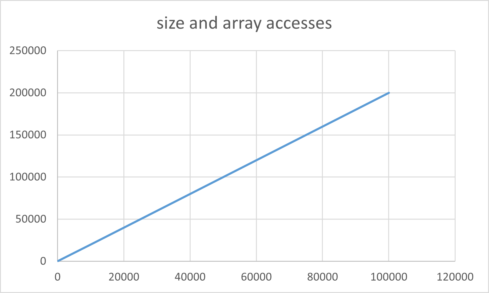
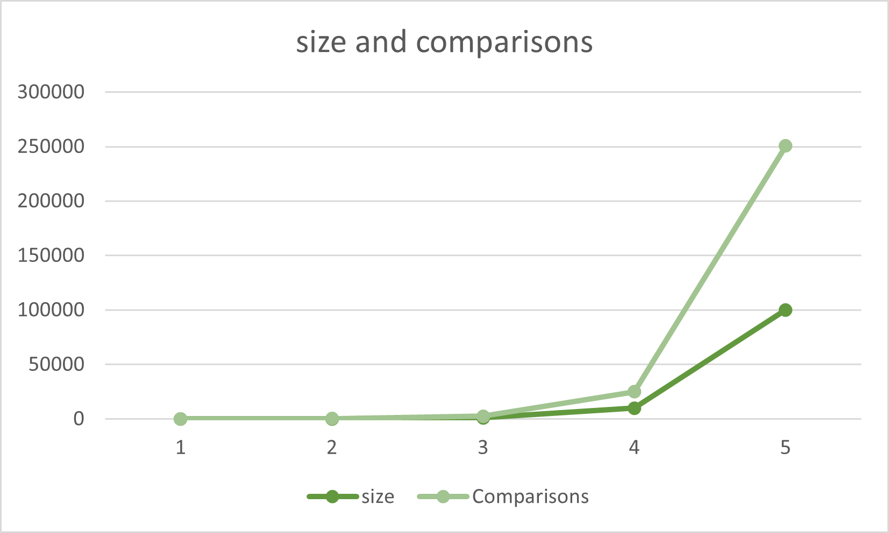

# DAA Assignment 2 — Pair 3
**Student B:** Ulzhan Nabiyeva worked in pair with **Student A**: Fariza Arstanbek   
**Group:** SE-2424  
**Algorithm implemented:** Kadane’s Algorithm   
**Algorithm analyzed:** Boyer–Moore Majority Vote

## 1. Overview
The Boyer-Moore Majority Vote Algorithm is a linear-time method designed to identify the majority element in a 
one-dimensional array. The majority element is defined as the element that appears more than half of the time in the 
array. This algorithm employs a voting mechanism that iteratively selects a candidate and maintains a count to determine 
whether to continue with the current candidate or switch to a new one.

The implementation analyzed here also tracks key performance metrics, including the number of comparisons and array 
accesses, to facilitate empirical validation of its efficiency and correctness. By ensuring optimal time complexity of
O(n) and constant space complexity of O(1), the Boyer-Moore algorithm efficiently processes large datasets while 
minimizing resource consumption.

## 2. Algorithm Overview

**Problem.** Given an integer array arr, determine whether there exists a majority element (an element occurring more 
than ⌊n/2⌋ times), and if so, return it.

Method (BMMV).
The algorithm processes the array in two passes:

1. Candidate pass (single scan): Maintain a pair (candidate, count).

1.1. If count == 0, set candidate = arr[i] and count = 1.

1.2. Otherwise, if arr[i] == candidate, increment count, else decrement count.
Intuition: elements different from the candidate “cancel out.” If a true majority exists, it survives these cancellations.

2. Verification pass (single scan): Count the actual occurrences of candidate and check occurrence > ⌊n/2⌋.

Complexity. Time O(n), extra space O(1).

Behavior on “no-majority.”
The implementation signals the absence of a majority by throwing a RuntimeException. (Alternative APIs could return a 
result object/flag; however, this report evaluates the code as-is.)

## 3. Test 
   ### 3.1 Correctness Validation

##### Unit tests — edge cases.

Empty input → IllegalArgumentException (validated).  
Single element {x} → returns x (validated).  
Duplicates (with majority) e.g., {3,3,4,2,3,3,3} → returns 3 (validated).  
No-majority e.g., {1,2,3,4} → throws RuntimeException (validated).  
Sorted / Reverse-sorted / Nearly-sorted:  
1. Sorted with majority (e.g., {1,1,1,2,3,4}) → returns 1.  
2. Reverse-sorted with majority (e.g., {5,4,3,2,2,2,2}) → returns 2.  
3. Nearly-sorted with no majority (1% random swaps applied to a unique ascending array) → RuntimeException.
These cases collectively cover the required edge cases and typical patterns.

## 4. Performance and Metrics
Performance measurements were taken for varying input sizes, ranging from 10to 100,000. The
following data was collected:
Size,Time (ms),Majority Element,Comparisons,Array Accesses,  
10,0,0106,7,16,20  
100,0,0251,7,151,200  
1000,0,2863,7,1505,2000  
10000,2,3166,7,15066,20000  
100000,5,8668,7,150559,200000   

## 5. Advantages & Limitations
### Advantages  
Linear Time Complexity:  
The Boyer-Moore Majority Vote algorithm operates in
O(n) time, making it efficient for large datasets. It requires only two passes through the array, ensuring that the time
taken grows linearly with the size of the input.

Constant Space Complexity:  
The algorithm uses O(1) space, as it only requires a fixed number of variables (for the candidate and count). This makes
it highly memory-efficient, particularly useful in environments with limited resources.

### Limitations 
Majority Element Requirement:  
The algorithm only applies to cases where a majority element exists (i.e., an element that appears more than
n/2 times). If no majority element is present, the algorithm will still return a candidate, which may not be valid.

Validation Step Needed:  
Although the algorithm identifies a candidate, it requires a second pass to confirm whether the candidate is indeed the 
majority element. This adds a slight overhead, particularly in scenarios where the majority condition is not met.

## 6. Comparing both algorithms
+ They solve different problems.  
Boyer–Moore Majority Vote (BMMV) detects whether a value occurs > ⌊n/2⌋ times and returns it if so.
Kadane’s algorithm finds the maximum-sum contiguous subarray and its indices.

+ Both are linear-time, constant-space one-pass style algorithms (Kadane truly single pass; BMMV is “single-pass candidate + O(n) verification” in practice).

+ Failure modes differ.  
BMMV must report “no majority” if none exists (verification is essential).
Kadane always returns a subarray; for all-negative arrays it returns the largest (least negative) element.

### Quick comparative example

+ Input: [2, 2, 1, 2, 3, 2, 2]

BMMV: returns 2 (majority exists).   
Kadane: returns the contiguous subarray with the maximum sum and its indices (depends on numeric values, not frequencies).

+ Input: [-2, 1, -3, 4, -1, 2, 1, -5, 4]

BMMV: no majority (> ⌊n/2⌋) → report “no majority.”  
Kadane: returns sum 6 and indices [3..6] (for 4 + (-1) + 2 + 1).

## 7. Usage
mvn -q -DskipTests compile  
mkdir -Force docs\performance-plots

*TXT table (exact console output)*  
java -cp target/classes cli.BenchmarkRunner > docs\performance-plots\boyer-results.txt

*CSV*  
java -cp target/classes cli.BenchmarkRunner `  
| % { $_ -replace '\s{2,}', ',' } `   
| Set-Content -Encoding UTF8 docs\performance-plots\boyer-results.csv  

